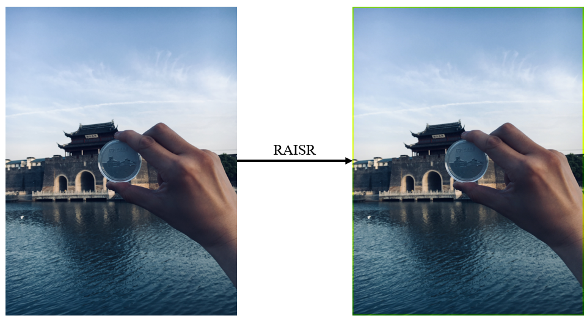

<div align="center">
  
</div>
<br />

[](http://imagecompressor.readthedocs.io/)
[](https://pypi.org/project/pyimagecompressor/)
[](https://pypi.org/project/pyimagecompressor)
[](https://github.com/CharlesPikachu/imagecompressor/blob/master/LICENSE)
[](https://pypi.org/project/pyimagecompressor/)
[](https://github.com/CharlesPikachu/imagecompressor/issues)
[](https://github.com/CharlesPikachu/imagecompressor/issues)

Documents: http://imagecompressor.readthedocs.io/


# ImageCompressor
```
Image compressors written by pure python.
You can star this repository to keep track of the project if it's helpful for you, thank you for your support.
```


# Support List
|   Compressor         |      Paper                                          | Introduction                                                  | Core Code                                                | In Chinese                    |
|   :----:             |      :----:                                         | :----:                                                        | :----:                                                   | :----:                        |
|   pil                |      N/A                                            | [click]()                                                     | [click](./imagecompressor/modules/compressors/pil.py)   | PIL自带压缩算法               |
|   raisr              |      [click](https://arxiv.org/pdf/1606.01299.pdf)  | [click]()                                                     | [click](./imagecompressor/modules/compressors/raisr.py) | 谷歌RAISR算法                 |
|   dct                |      N/A                                            | [click]()                                                     | [click](./imagecompressor/modules/compressors/dct.py)   | 基于离散余弦变换的图像压缩    |
|   svd                |      N/A                                            | [click]()                                                     | [click](./imagecompressor/modules/compressors/svd.py)   | 基于奇异值分解的图像压缩      |


# Install

#### Pip install
```
run "pip install pyimagecompressor"
```

#### Source code install
```sh
(1) Offline
Step1: git clone https://github.com/CharlesPikachu/imagecompressor.git
Step2: cd imagecompressor -> run "python setup.py install"
(2) Online
run "pip install git+https://github.com/CharlesPikachu/imagecompressor.git@master"
```


# Quick Start
```python
from imagecompressor import imagecompressor

compressor = imagecompressor.ImageCompressor('dct')
image, eavl_result = compressor('input.jpg')
```


# Screenshot



# Projects in Charles_pikachu
- [Games](https://github.com/CharlesPikachu/Games): Create interesting games by pure python.
- [DecryptLogin](https://github.com/CharlesPikachu/DecryptLogin): APIs for loginning some websites by using requests.
- [Musicdl](https://github.com/CharlesPikachu/musicdl): A lightweight music downloader written by pure python.
- [Videodl](https://github.com/CharlesPikachu/videodl): A lightweight video downloader written by pure python.
- [Pytools](https://github.com/CharlesPikachu/pytools): Some useful tools written by pure python.
- [PikachuWeChat](https://github.com/CharlesPikachu/pikachuwechat): Play WeChat with itchat-uos.
- [Pydrawing](https://github.com/CharlesPikachu/pydrawing): Beautify your image or video.
- [ImageCompressor](https://github.com/CharlesPikachu/imagecompressor): Image compressors written by pure python.


# More
#### WeChat Official Accounts
*Charles_pikachu*  
